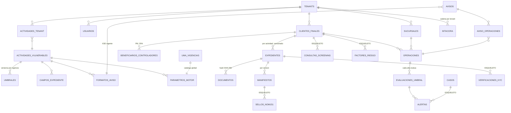

# VIZO MVP — Arquitectura del sistema

**Versión 1 · 4 de agosto de 2026 · Sesión de planeación con Claude**
Este documento es la especificación de diseño del MVP (Fr. V Bis). No contiene código: las migraciones se escriben en la semana 1 siguiendo esto. Complementa `01_ARQUITECTURA_V4.md` del paquete de referencia; donde difieren, manda este documento (las diferencias están en `DECISIONES.md`).

---

## 1. Principio rector

> Todo lo regulatorio es **dato versionado por vigencia**. Nada regulatorio es **código**.

Prueba de que se cumple (se ejecuta en la semana 11): dar de alta la **Fracción XV** (arrendamiento) solo con INSERTs al catálogo — sin tocar `src/`, sin deploy — y que el motor la evalúe correctamente.

## 2. Convenciones transversales

- **Toda tabla** tiene `id uuid PK DEFAULT gen_random_uuid()` y `created_at timestamptz NOT NULL DEFAULT now()` (reloj del servidor, UTC). El cliente **nunca** aporta timestamps.
- **Toda tabla de datos del tenant** tiene `tenant_id uuid NOT NULL REFERENCES tenants(id)` y política RLS desde su migración de nacimiento. Una tabla sin RLS es un incidente, no un pendiente. Esto aplica también a las tablas-esqueleto vacías.
- **Montos:** `numeric(14,2)` en Postgres; enteros de centavos en TypeScript. Nunca `float`.
- **Append-only** (en `bitacora`, `operaciones`, `evaluaciones_umbral`, `documentos`): sin `UPDATE` ni `DELETE`, forzado con `REVOKE` a nivel de grants **y** ausencia de políticas RLS de UPDATE/DELETE. Corrección = fila nueva que referencia a la corregida.
- **Dominio en español, infraestructura en inglés.** No se traducen términos legales.
- Los "enums" se listan aquí con sus valores; en la implementación pueden ser `enum` de Postgres o `text + CHECK` (decisión de semana 1, sin impacto de diseño).

## 3. Modelo de datos

### 3.1 Catálogo regulatorio — Capa 0 (global, sin `tenant_id`)

Estas tablas son la fuente de verdad regulatoria. **Lectura para todos los usuarios autenticados; escritura solo por migración/seed** (ninguna ruta de la app escribe aquí). Los valores nunca se actualizan: se **cierra la vigencia** (`vigente_hasta`) y se inserta la fila nueva.

**`uma_vigencias`** — valor de la UMA aplicable a umbrales por rango de fechas

| Columna | Tipo | Notas |
|---|---|---|
| valor_diario | numeric(8,2) | ej. 117.31 |
| vigente_desde | date | **1 de febrero** del año (no 1 de enero) |
| vigente_hasta | date NULL | NULL = vigencia abierta |
| fuente_dof | text | URL/fecha de publicación |

Restricción: rangos de vigencia sin traslape (exclusion constraint sobre daterange). Consulta canónica: `uma_vigente(fecha_operacion)`.

**`actividades_vulnerables`** — las fracciones del Art. 17

| Columna | Tipo | Notas |
|---|---|---|
| fraccion | text UNIQUE | 'V_BIS', 'XV', … |
| nombre | text | "Desarrollo inmobiliario" |
| descripcion | text | |

**`umbrales`** — por actividad, tipo y vigencia

| Columna | Tipo | Notas |
|---|---|---|
| actividad_id | uuid FK | |
| tipo | enum | 'identificacion' \| 'aviso' \| 'efectivo' |
| siempre | boolean DEFAULT false | true = obligación sin importar monto (identificación en V Bis) |
| valor_uma | numeric(10,2) NULL | NULL solo si `siempre = true` |
| base | enum | 'sin_iva' (Art. 17) \| 'con_iva' (Art. 32). **Es una columna, no un `if`** |
| vigente_desde / vigente_hasta | date | mismo patrón que UMA |
| fuente | text | fundamento (artículo/DOF/webinar) |

**`campos_expediente`** — qué integra el expediente por actividad (alimenta la completitud)

| Columna | Tipo | Notas |
|---|---|---|
| actividad_id | uuid FK | |
| aplica_a | enum | 'persona_fisica' \| 'persona_moral' \| 'ambas' |
| campo | text | clave técnica, ej. 'identificacion_oficial' |
| etiqueta | text | texto para la UI |
| tipo_dato | enum | 'texto' \| 'fecha' \| 'monto' \| 'catalogo' \| 'documento' |
| obligatorio | boolean | |
| validacion | jsonb | regex/valores permitidos/etc. |
| vigente_desde / vigente_hasta | date | los campos también cambian con las RCG |

El contenido real de esta tabla para V Bis sale de `docs/campos-aviso.md` (extracción del XSD + instructivo, semana 1). Campos más allá del XSD: **POR CONFIRMAR con especialista PLD**.

**`formatos_aviso`** — versión de XSD vigente por actividad

| Columna | Tipo | Notas |
|---|---|---|
| actividad_id | uuid FK | |
| version | text | ej. 'inmuebles-2016-v1' (la que esté publicada en SPPLD) |
| ruta_xsd | text | path en `regulatorio/xsd/` (versionado en el repo) |
| vigente_desde / vigente_hasta | date | cuando salgan las RCG: fila nueva, no edición |
| notas | text | |

**`parametros_motor`** — todo parámetro de evaluación que no es umbral

| Columna | Tipo | Notas |
|---|---|---|
| actividad_id | uuid FK NULL | NULL = global |
| clave | text | ej. 'ventana_acumulacion_meses', 'umbral_proximidad_pct', 'dia_limite_presentacion', 'dia_alerta_presentacion' |
| valor | jsonb | ej. `6`, `90`, `17`, `10` |
| vigente_desde / vigente_hasta | date | |

Hasta la ventana de 6 meses y el día 17 son datos con vigencia: si una RCG los cambia, es un INSERT.

### 3.2 Tenancy y usuarios

**`tenants`** — el sujeto obligado (v1: uno solo, demo; el diseño es multi-tenant desde el día 1)

| Columna | Tipo |
|---|---|
| rfc | text UNIQUE |
| razon_social | text |
| domicilio | jsonb |

**`sucursales`** — `tenant_id`, `nombre text`, `clave text`. La acumulación cruza sucursales del mismo tenant.

**`actividades_tenant`** — qué fracciones realiza el tenant: `tenant_id`, `actividad_id`, `activo boolean`. UNIQUE(tenant_id, actividad_id). Los umbrales/expedientes/avisos se calculan **por fracción, nunca sumando fracciones**.

**`usuarios`** — perfil de aplicación sobre Supabase Auth

| Columna | Tipo | Notas |
|---|---|---|
| id | uuid PK | = `auth.users.id` |
| tenant_id | uuid FK | |
| rol | enum | 'admin' \| 'capturista' |
| nombre, email | text | |
| activo | boolean | |

### 3.3 Núcleo operativo

**`clientes_finales`**

| Columna | Tipo | Notas |
|---|---|---|
| tenant_id | uuid FK | |
| tipo_persona | enum | 'fisica' \| 'moral' |
| rfc | text NULL | UNIQUE parcial (tenant_id, rfc) WHERE rfc IS NOT NULL |
| curp | text NULL | refuerzo de identidad para PF |
| nombre_o_razon_social | text | |
| nombre_normalizado | text | generado: upper, sin acentos, espacios colapsados |
| fecha_nacimiento_o_constitucion | date NULL | |
| nacionalidad | text | |
| identidad_alterna | jsonb NULL | extranjero sin RFC: `{tipo_doc, numero, pais}` — clave de acumulación conservadora |
| requiere_revision_identidad | boolean DEFAULT false | se enciende cuando la identidad no se resolvió por RFC/CURP |
| nivel_riesgo | enum NULL | **ESQUELETO** — 'bajo' \| 'medio' \| 'alto'. Nadie lo escribe en v1 |
| created_by | uuid FK usuarios | |

Resolución de identidad para acumulación: (1) RFC normalizado; (2) CURP; (3) `identidad_alterna` (tipo_doc + numero + pais) **acumulando conservadoramente** y encendiendo `requiere_revision_identidad`. Nunca por nombre solo. Criterio definitivo para extranjeros: **POR CONFIRMAR con especialista PLD**.

**`beneficiarios_controladores`** — solo para clientes persona moral (y figuras análogas)

| Columna | Tipo | Notas |
|---|---|---|
| tenant_id, cliente_id | uuid FK | cliente con tipo_persona = 'moral' |
| nombre | text | |
| rfc, curp | text NULL | |
| participacion_pct | numeric(5,2) NULL | umbral legal de registro: **25%** (dato del catálogo/UI, no constante del motor) |
| control_por | enum | 'participacion' \| 'control_efectivo' |
| es_declaracion | boolean | true cuando es la declaración recabada (PF declara existencia) |

**`expedientes`** — uno por cliente + actividad, versionado

| Columna | Tipo | Notas |
|---|---|---|
| tenant_id, cliente_id, actividad_id | uuid FK | UNIQUE(tenant, cliente, actividad, version) |
| version | int DEFAULT 1 | cambia el contenido → nueva versión de manifiesto, no se pisa la anterior |
| estatus | enum | 'incompleto' \| 'completo' \| 'aprobado' |
| completitud | jsonb | resultado del cruce contra `campos_expediente` vigentes: `{faltantes:[], porcentaje}` |
| aprobado_por / aprobado_en | uuid / timestamptz NULL | |

La completitud se **calcula** contra el catálogo en cada consulta/cambio; el jsonb es caché del último cálculo. Quitar un campo del catálogo cambia la completitud sin tocar código.

**`documentos`** — append-only

| Columna | Tipo | Notas |
|---|---|---|
| tenant_id, expediente_id | uuid FK | |
| campo | text | clave de `campos_expediente` que satisface |
| storage_path | text | bucket privado de Supabase Storage |
| hash_sha256 | char(64) | calculado sobre el byte stream **tal como se guarda** |
| tamano_bytes | bigint | |
| mime | text | |
| reemplaza_a | uuid FK NULL | reemplazo = fila nueva; la vieja no se borra |
| subido_por | uuid FK | |

**`operaciones`** — append-only, timestamp del servidor

| Columna | Tipo | Notas |
|---|---|---|
| tenant_id, sucursal_id, cliente_id, actividad_id | uuid FK | |
| fecha_operacion | date | fecha del acto (la aporta el capturista) |
| monto_base | numeric(14,2) | sin IVA ni accesorios — base del Art. 17 |
| iva | numeric(14,2) DEFAULT 0 | |
| monto_total | numeric(14,2) | = base + iva (CHECK) — base del Art. 32 y monto del aviso |
| forma_pago | text | catálogo SAT (c_FormaPago) |
| moneda | char(3) DEFAULT 'MXN' | |
| cfdi_uuid | uuid NULL | listo para el parser CFDI; NULL en captura manual |
| descripcion_bien | text | |
| corrige_a | uuid FK NULL | corrección = fila nueva; vista `operaciones_vigentes` excluye toda fila que sea blanco de un `corrige_a` |
| registrado_por | uuid FK | |
| registrado_en | timestamptz DEFAULT now() | **reloj del servidor. El cliente no puede escribir esta columna** |

**`evaluaciones_umbral`** — append-only; el registro defendible de cada corrida del motor

| Columna | Tipo | Notas |
|---|---|---|
| tenant_id, operacion_id, actividad_id | uuid FK | |
| uma_valor / uma_vigencia | numeric / daterange | la UMA con la que se evaluó |
| umbrales_aplicados | jsonb | snapshot de los umbrales vigentes usados (id, tipo, valor_uma, base, pesos calculados) |
| parametros_aplicados | jsonb | ventana, % proximidad, etc. |
| monto_base_considerado / monto_total_considerado | numeric(14,2) | |
| requiere_identificacion | boolean | |
| resultado_aviso | enum | 'no' \| 'individual' \| 'acumulacion' |
| efectivo_restringido | boolean | |
| alerta_proximidad | boolean | |
| suma_ventana | numeric(14,2) NULL | suma de la ventana de acumulación al momento |
| operaciones_acumuladas | uuid[] | qué operaciones entraron a la ventana |
| requiere_revision_identidad | boolean | identidad no resuelta por RFC/CURP |
| evaluado_en | timestamptz DEFAULT now() | |

No hay tabla `acumulados` materializada: la ventana se calcula por consulta sobre `operaciones` y **queda registrada** aquí (ver DECISIONES.md, ADR-07).

**`alertas`**

| Columna | Tipo | Notas |
|---|---|---|
| tenant_id | uuid FK | |
| tipo | enum | 'proximidad' \| 'aviso_requerido' \| 'revision_identidad' \| 'screening' \| 'calendario' |
| evaluacion_id | uuid FK NULL | origen |
| consulta_screening_id | uuid FK NULL | **ESQUELETO** — origen futuro |
| estado | enum | 'abierta' \| 'atendida' |
| atendida_por / atendida_en | uuid / timestamptz NULL | |
| caso_id | uuid FK NULL | **ESQUELETO** — liga a `casos` |

### 3.4 Aviso

**`avisos`**

| Columna | Tipo | Notas |
|---|---|---|
| tenant_id, actividad_id | uuid FK | |
| periodo | date | primer día del mes reportado |
| tipo | enum | 'normal' \| 'acumulacion' \| 'cero' \| 'modificatorio' \| **'24h'** — los dos últimos no se generan en v1, pero el tipo existe desde hoy |
| estatus | enum | 'borrador' \| 'generado' \| 'validado' \| 'listo_revision' \| 'aprobado' \| 'presentado' |
| formato_aviso_id | uuid FK | contra qué XSD se generó/validó |
| xml_storage_path | text NULL | |
| hash_xml | char(64) NULL | |
| fragmentos | int DEFAULT 1 | por el límite de 2 MB del SPPLD |
| aprobado_por / aprobado_en | uuid / timestamptz NULL | solo rol admin; queda además en bitácora |
| acuse_storage_path | text NULL | el acuse lo sube el usuario tras presentar en el portal |
| acuse_registrado_en | timestamptz NULL | |

**`aviso_operaciones`** — join: `aviso_id`, `operacion_id`, `evaluacion_id`. Qué operaciones ampara cada aviso y con qué evaluación.

**`manifiestos`** — el objeto sellable

| Columna | Tipo | Notas |
|---|---|---|
| tenant_id, expediente_id | uuid FK | |
| version | int | = versión del expediente |
| contenido | jsonb | JSON canónico (ver §8) |
| hash_sha256 | char(64) | hash del JSON canónico serializado |
| hash_bitacora_cabeza | char(64) | cabeza de la cadena al momento de generar |
| catalogo_version | text | identificador del estado del catálogo usado |
| generado_en | timestamptz DEFAULT now() | |

**`sellos_nom151`** — **ESQUELETO** (vacía en v1; se llena cuando se contrate PSC)

| Columna | Tipo |
|---|---|
| tenant_id | uuid FK |
| objeto_tipo | enum: 'manifiesto' \| 'aviso' |
| objeto_id | uuid |
| hash_sellado | char(64) |
| psc | text |
| constancia_storage_path | text |
| fecha_cierta | timestamptz |

### 3.5 Bitácora (ver §7)

**`bitacora`** — append-only, encadenada por hash, una cadena por tenant

| Columna | Tipo | Notas |
|---|---|---|
| id | bigint IDENTITY | |
| tenant_id | uuid FK | |
| secuencia | bigint | consecutivo por tenant, sin huecos |
| evento | text | del catálogo de eventos (§7) |
| objeto_tipo / objeto_id | text / uuid | a qué apunta |
| datos | jsonb | **solo IDs opacos y valores no personales** |
| actor_id | uuid NULL | NULL = sistema |
| ocurrido_en | timestamptz DEFAULT now() | servidor, UTC |
| hash_previo | char(64) | de la fila anterior del mismo tenant (génesis: hash de constante conocida) |
| hash | char(64) | sha256(hash_previo ‖ serialización canónica de la fila) — calculado por trigger, jamás por el cliente |

### 3.6 Esqueleto post-MVP (tablas vacías con RLS, columnas listas)

Se crean en la migración 001 y **nadie las escribe en v1**. Existen porque agregarlas después sería migración de riesgo sobre datos vivos.

**`consultas_screening`**

| Columna | Tipo | Notas |
|---|---|---|
| tenant_id | uuid FK | |
| sujeto_tipo | enum: 'cliente' \| 'beneficiario' | |
| sujeto_id | uuid | |
| listas_consultadas | jsonb | OFAC, ONU/UIF, LPB, 69-B, PEP + versión/fecha de cada lista |
| coincidencias | jsonb | |
| resultado | enum | 'sin_coincidencia' \| 'coincidencia' |
| resolucion | enum | 'pendiente' \| 'descartada' \| 'confirmada' — **el descarte siempre es humano** |
| resuelto_por / resuelto_en / razonamiento | uuid / timestamptz / text | la evidencia que se presenta a la autoridad |

**`factores_riesgo`** — `tenant_id`, `cliente_id`, `factor text`, `valor jsonb`, `peso numeric`, `evaluado_en`. Vacía; el modelo de la matriz depende de las RCG.

**`casos`** — `tenant_id`, `titulo`, `estado ('abierto'|'en_revision'|'cerrado')`, `abierto_por/abierto_en`, `cerrado_en`, `resolucion text`. Las alertas se ligan vía `alertas.caso_id`.

**`verificaciones_kyc`** — `tenant_id`, `expediente_id`, `proveedor`, `resultado`, `payload jsonb`, `verificado_en`. Vacía hasta que haya proveedor KYC.

### 3.7 Diagrama



---

## 4. Capa 0: cómo se versiona lo regulatorio

1. **Nunca UPDATE de un valor vigente.** El cambio regulatorio se modela cerrando `vigente_hasta` de la fila actual e insertando la nueva con su `vigente_desde`. La historia completa queda consultable — necesaria para reevaluar o defender operaciones viejas con los valores de su época.
2. **Toda consulta del motor es "as of":** `uma_vigente(fecha_operacion)`, `umbrales_vigentes(actividad, fecha_operacion)`, `formato_vigente(actividad, periodo)`. Jamás "el valor actual".
3. **El seed inicial** (semana 1) carga: UMA 2025 ($113.14, vigencia 1 feb 2025 – 31 ene 2026) y 2026 ($117.31, desde 1 feb 2026); umbrales V Bis (identificación `siempre`; aviso 8,025 UMA `sin_iva`; efectivo 8,025 UMA `con_iva`); parámetros (ventana 6 meses, proximidad 90%, día límite 17, día alerta 10). Cada fila con su `fuente`. La tabla queda **pendiente de validación por el especialista PLD** — el seed lo dice en su propia columna fuente.
4. **Cuando salgan las RCG:** insertar formatos/umbrales/campos nuevos con su vigencia y subir el XSD nuevo a `regulatorio/xsd/`. Cero deploys de código. Ese es exactamente el evento para el que existe esta capa.
5. `catalogo_version` (usada por evaluaciones y manifiestos) = identificador derivado del estado del catálogo (p. ej. hash de las filas vigentes aplicables). Permite decir "esta evaluación se hizo con el catálogo tal".

## 5. Motor de evaluación

**Forma:** función pura y determinista, agnóstica de fracción.

```
evaluar(operacion, configActividad) -> Evaluacion
```

- `operacion`: {cliente (con identidad resuelta), sucursal, actividad, fecha_operacion, monto_base, iva, monto_total, forma_pago, historial: operaciones del mismo cliente+actividad en la ventana}.
- `configActividad`: el snapshot "as of fecha_operacion" del catálogo: UMA vigente, umbrales (con su columna `base`), parámetros (ventana, % proximidad). **El motor no consulta la base de datos ni conoce fracción alguna**: recibe configuración. Un módulo aparte (el cargador) arma `configActividad` desde la Capa 0.
- **El motor no usa LLM en ningún punto. Nada probabilístico decide un monto, umbral o resultado.**

**Proceso (orden fijo):**

1. Resolver identificación: `siempre` o `monto_base >= umbral_identificacion` (base sin IVA).
2. Aviso individual: `monto_base >= umbral_aviso` (base sin IVA).
3. Acumulación: sumar `monto_base` de las operaciones del historial que **individualmente** caen en supuesto de identificación (en V Bis: todas), dentro de la ventana (parámetro, 6 meses) contada hacia atrás desde `fecha_operacion`, cruzando sucursales, **nunca cruzando actividades**. Si `suma + monto_base >= umbral_aviso` y el aviso individual no aplicó → `resultado_aviso = 'acumulacion'`, disparado **ahora** (no al cierre del periodo).
4. Efectivo: si `forma_pago` es efectivo y `monto_total >= umbral_efectivo` (base con IVA) → `efectivo_restringido = true`.
5. Proximidad: si no hubo aviso y `monto_base` (o la suma de ventana) ≥ `umbral_proximidad_pct` del umbral de aviso → `alerta_proximidad = true`.
6. Identidad: si la identidad se resolvió por `identidad_alterna` (sin RFC/CURP) → `requiere_revision_identidad = true` (acumulación conservadora: se suma, no se asume cliente distinto).

**Salida:** el registro completo de `evaluaciones_umbral` (§3.3): resultados + todos los insumos (UMA, umbrales snapshot, parámetros, operaciones acumuladas). Regla: **una evaluación que no registra sus insumos no existe** — es lo que se defiende en una verificación años después.

**Disparo:** cada INSERT en `operaciones` evalúa síncronamente. No hay job mensual para acumulación. Re-evaluación (por corrección de operación) = nueva fila de evaluación; nunca se edita una evaluación.

**Prueba de agnosticismo (semana 11):** alta de Fr. XV (identificación 1,605 / aviso 3,210 / efectivo 3,210 UMA) solo con INSERTs. El caso Fr. XV de `PRUEBAS.md` pasa sin cambio alguno en `src/`.

## 6. Pipeline de generación del aviso

```
operaciones con resultado_aviso ≠ 'no' (o periodo sin reportables → informe en cero)
  → agrupar por tenant + actividad + periodo
  → generar XML según formato_vigente(actividad, periodo)   [XSD de formatos_aviso]
  → VALIDAR contra XSD                                       [BLOQUEANTE — si no valida, el aviso no existe]
  → fragmentar si el XML > 2 MB (numeración de lotes)
  → estatus 'listo_revision'
  → aprobación humana (solo admin; evento en bitácora)       [BLOQUEANTE]
  → estatus 'aprobado' → el usuario descarga y presenta en el SPPLD con la e.firma del REC
  → el usuario sube el acuse → estatus 'presentado' (evento en bitácora)
```

- Los **dos pasos bloqueantes no se saltan nunca**: la validación XSD (automatizada, `test:xsd` en CI con los ejemplos oficiales como fixtures) y la aprobación humana (registrada).
- **VIZO nunca presenta el aviso.** No hay API del SPPLD; el envío es manual con e.firma del REC. En el MVP el rol admin ejerce esa aprobación.
- El monto reportado en el XML es el **total recibido incluyendo contribuciones** — distinto de la base sin IVA con la que se evaluó el umbral. Ambos vienen de la operación; la correspondencia campo XML ↔ columna se especifica en `docs/campos-aviso.md`.
- **Informe en cero:** si el periodo no tuvo operaciones reportables, el pipeline genera el informe en cero por el mismo camino (mismo flujo de estados y aprobación). Es obligación legal, no opción.
- Tipos `modificatorio` y `24h`: existen en el enum y en el diseño del flujo (el `24h` es event-driven, disparado por una alerta, no por cierre de periodo), pero **no se generan en v1**.

## 7. Bitácora

**Encadenamiento.** Una cadena por tenant. Cada fila: `hash = sha256(hash_previo ‖ serialización canónica de {tenant_id, secuencia, evento, objeto_tipo, objeto_id, datos, actor_id, ocurrido_en})`. La fila génesis usa un `hash_previo` constante documentado. El hash lo calcula un trigger con el reloj del servidor; ninguna ruta de la app puede escribirlo. `secuencia` es consecutiva por tenant: un hueco o un hash que no cuadra = cadena rota, detectable por el verificador (semana 8).

**Solo INSERT**, forzado por grants (REVOKE UPDATE/DELETE) y por ausencia de políticas RLS de escritura. Corrección de un error operativo = **evento nuevo** que lo dice (`operacion.corregida`), jamás edición.

**Catálogo de eventos v1** (`objeto.accion`):

| Evento | Cuándo |
|---|---|
| `cliente.alta`, `cliente.identidad_marcada` | alta; identidad no resuelta por RFC/CURP |
| `beneficiario.alta` | |
| `expediente.creado`, `expediente.completo`, `expediente.aprobado`, `expediente.nueva_version` | transiciones de estatus |
| `documento.subido`, `documento.reemplazado` | con hash en `datos` |
| `operacion.registrada`, `operacion.corregida` | |
| `evaluacion.registrada` | con resultado y evaluacion_id |
| `alerta.creada`, `alerta.atendida` | |
| `aviso.generado`, `aviso.validado`, `aviso.aprobado`, `aviso.presentado`, `aviso.acuse_registrado` | el `aprobado` incluye actor — es la aprobación humana bloqueante |
| `manifiesto.generado` | con hash del manifiesto |
| `catalogo.seed_aplicado` | qué versión de catálogo se cargó |

**Reconstrucción histórica:** el estado de cualquier objeto en una fecha se reconstruye filtrando sus eventos hasta esa fecha (los eventos llevan los IDs y hashes necesarios). Entregable de la semana 8: la consulta "expediente X en la fecha Y" y el verificador de cadena.

**Sin datos personales en `datos`:** IDs opacos y hashes. Nombres, RFC, CURP y direcciones viven en sus tablas (con RLS), nunca en la bitácora, ni en logs, ni en Sentry.

## 8. Manifiesto del expediente

JSON **canónico** (serialización determinista: claves ordenadas, sin espacios, UTF-8, números como strings decimales — estilo RFC 8785) por **versión** de expediente:

```
{
  "expediente": {id, cliente_id, actividad, version},
  "cliente": {hash_identidad},                 // hash de los datos de identidad, no los datos
  "documentos": [{campo, hash_sha256, tamano_bytes, mime}...],   // ordenados por campo
  "operaciones": [{id, fecha, monto_base, iva, monto_total, forma_pago}...],  // ordenadas por id
  "evaluaciones": [{id, resultado_aviso, uma_valor}...],
  "bitacora_cabeza": hash,                     // ata el manifiesto a la cadena de custodia
  "catalogo_version": id,
  "generado_en": timestamp UTC
}
```

- `hash_sha256(manifiesto)` se registra en `manifiestos`. Cambia el expediente → **nueva versión** de expediente y nuevo manifiesto; los anteriores se conservan.
- **Sellado futuro sin rediseño:** cuando se contrate el PSC NOM-151, se sella el hash ya registrado (una constancia por versión) y se llena `sellos_nom151`. Nada del formato cambia — por eso el manifiesto se diseña hoy y se sella después. Un PSC que selle solo el hash (sin recibir el documento) mantiene los datos personales fuera de su alcance.
- La granularidad (manifiesto vs. constancia por documento) está **POR CONFIRMAR con especialista PLD**; si la respuesta fuera "por documento", los hashes por documento ya existen en `documentos` y el cambio es de alcance del sellado, no del esquema.

## 9. Autenticación y roles

- **Supabase Auth** (email + contraseña en v1). `usuarios` liga `auth.users.id` con `tenant_id` y `rol`. El JWT carga `tenant_id` y `rol` en `app_metadata` (solo escribible por servicio) para que RLS los lea sin joins.
- Funciones helper en RLS: `auth_tenant_id()` y `auth_rol()` leyendo el JWT.

**Matriz de permisos v1:**

| Acción | capturista | admin |
|---|---|---|
| Ver datos de su tenant | ✔ | ✔ |
| Alta/edición de clientes, beneficiarios, documentos | ✔ | ✔ |
| Registrar operaciones | ✔ | ✔ |
| Aprobar expediente | ✖ | ✔ |
| Generar aviso / informe en cero | ✖ | ✔ |
| **Aprobar aviso** (rol tipo REC en v1) | ✖ | ✔ |
| Registrar acuse | ✖ | ✔ |
| Atender alertas | ✔ | ✔ |
| Gestionar usuarios del tenant | ✖ | ✔ |
| Escribir al catálogo regulatorio | ✖ | ✖ (solo migración/seed) |
| UPDATE/DELETE en bitácora, operaciones, evaluaciones, documentos | ✖ | ✖ (nadie — append-only) |

**Política RLS tipo por tabla de tenant:**

- SELECT: `tenant_id = auth_tenant_id()`
- INSERT: `tenant_id = auth_tenant_id()` + condición de rol cuando aplica (p. ej. aprobar = `auth_rol() = 'admin'`, expresado en la transición de estatus vía función `SECURITY DEFINER` auditada, no con UPDATE libre)
- UPDATE/DELETE: sin política en tablas append-only (= imposible); en las demás, restringido por rol.
- Catálogo (Capa 0): SELECT para `authenticated`; sin políticas de escritura.
- Transiciones de estado sensibles (aprobar expediente/aviso, registrar acuse) pasan por funciones `SECURITY DEFINER` que validan rol, ejecutan el cambio permitido **y escriben el evento de bitácora en la misma transacción**.
- La **service key** no aparece jamás en código de aplicación; solo migraciones/seed.

**Prueba negativa obligatoria (semana 5, en CI):** con dos tenants seed, el usuario del tenant B no lee nada del tenant A; el capturista no puede aprobar. Si esa prueba pasa trivialmente (p. ej. porque RLS está desactivada), es incidente, no éxito.

## 10. Resumen de cumplimiento de restricciones no negociables

| Restricción | Dónde se cumple |
|---|---|
| Bitácora append-only, correcciones = eventos | §7 (grants + trigger + catálogo de eventos) |
| Timestamp UTC del servidor | §2, `registrado_en`/`ocurrido_en` DEFAULT now(), cliente sin permiso de escribirlos |
| tenant_id + RLS en toda tabla desde el día uno | §2, §3 (incluye tablas-esqueleto), §9 |
| LLM nunca calcula montos/umbrales/riesgo | §5 (motor puro, sin LLM; en v1 no hay LLM en ningún flujo) |
| Todo lo regulatorio es dato versionado | §3.1, §4 (hasta la ventana de 6 meses y el día 17 son `parametros_motor`) |
| Infraestructura propia y aislada | Supabase/Vercel/GitHub propios de VIZO (semana 0) |
| Motor agnóstico de fracción | §5 (firma con `configActividad`) + prueba Fr. XV (semana 11) |
